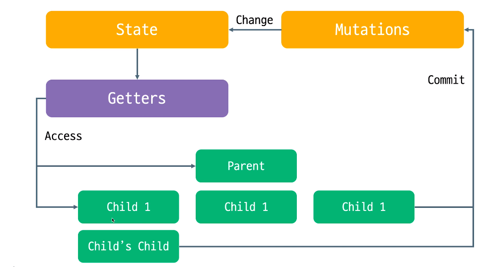
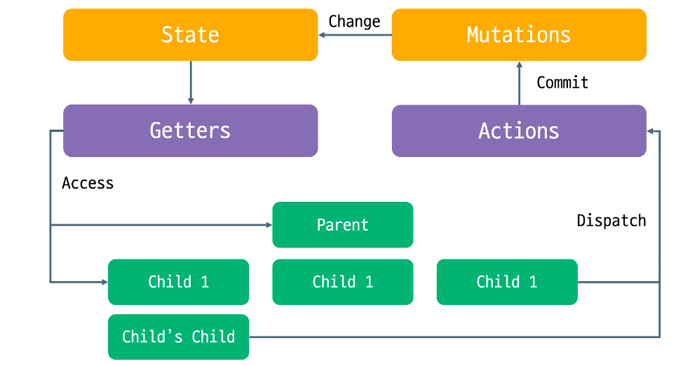

[맨땅에 개발하기 유튜브 채널-Vuex Tutorial](https://www.youtube.com/channel/UCZ6yPRDNz9bNWySjAv8kUng/playlists) 강의를 듣고 작성한 문서입니다.
### 강의 목차
- 1강 VueJS & Vuex   
- 2강 State  
- 3,4,5강 Getters(mapGetters)  
- 6강 Mutations  
- 7강 Actions  

## 디렉터리 구조  
  
│  App.vue 							# 최상위  
│  main.js  
│  router.js 							# 각각의 route 주소 설정  
│  store.js  
│  
├─assets  
│      logo.png  
│      logo.svg  
│  
├─components					# **기능** 단위  
│  └─Users  
│          AllUsers.vue				# 모든 유저의 목록  
│          SignUp.vue				  # 회원가입 기능  
│  
├─plugins  
│      vuetify.js  
│  
└─views								# **레이아웃**만 포함  
        Home.vue					# Home 화면   
        Users.vue					 # Users 목록을 보여줌  

  

### tip

$store, $router, $route 등 달러표시는 main.js에 적용되어있는 것  

# 📌State

store의 data역할  

# 📌getters

store의 computed 역할

다른점 : function의 인수로 state를 받는다.

반복되는 코드를 줄일 수 있다.


### mapGetters, mapState

computed속성에 정의함


# 📌mutations

컴포넌트에서도 state의 값을 직접 변경할 수 있는데 왜 mutations을 써야하는가?

1. 각 컴포넌트 내에서 mutations 내에 저장되어있는 함수를 commit함
2. state값을 변화시킴

같은 기능을 하는 함수들은 각각의 컴포넌트에 작성하지 않고, commit만 해도 된다.


3. 바뀐 state값들이 getters로 전달됨. 이어서 컴포넌트로 전달됨.



### mapMutations

methods에 정의

addUsers라는 mutation이 있을때, 컴포넌트 내 어떤 method에서 

- 방법1) **this.addUsers(userObj)**
- 방법2) **this.$store.commit('addUsers',userojb)**

userObj가 mutations-addUsers-payload로 전달된다. 


# actions

mutation에 비동기 로직들이 포함되면, 같은 값에 대해 여러 개의 컴포넌트에서 변경을 요청했을 때, 그 순서를 정확히 알기 어렵다.

비동기 로직은 actions에서 다룬다.

````javascript
```javascript

```

state를 변화시키는 것은 일단 mutations에 넣는다.

이 mutation을 동작시키는 비즈니스 로직을 actions에 넣는다.
````





**dispatch->actions->commit->mutation**


mutation과 actions가 큰 차이는 없다. 

actions가 불필요해 보일 수 있다. 

**state를 변화시키는 건 mutation.**

**동작시키는 로직은 actions에 작성한다.**

actions에는 http 비동기 통신 로직을 주로 작성.

결과로 다 받아온 값을 mutation으로 return한다. 
